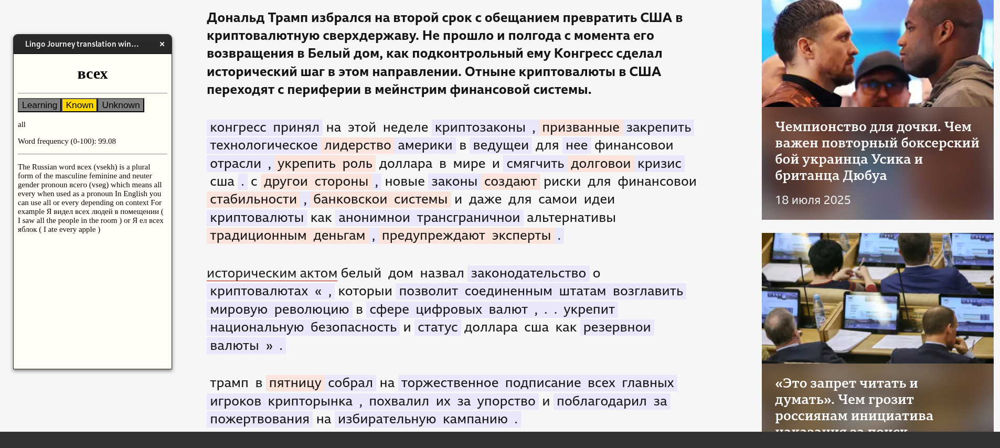
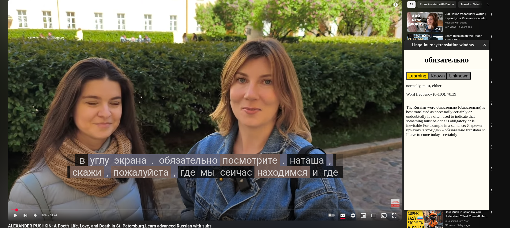
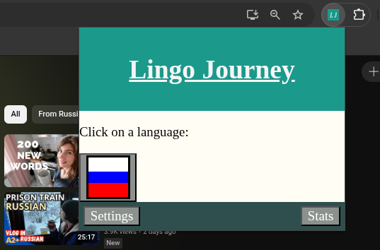
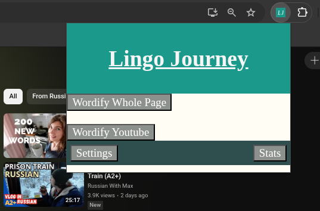

# LingoJourney
 
 

 This is the reposity for the Lingo Journey chrome extension (https://chromewebstore.google.com/detail/lingo-journey/hkkghimlnkomhmnndmnnidbpilokcaeo).
 
 The goal of Lingo Journey is to help you learn a new language by providing on-click translations along with, word highlighting, pronounciation and keeping track of all the words you know so you can monitor your progress.

## Languages supported
- Russian
 
*Support for German and many more planned in the near future*

## Screenshots

 
*Image showes Lingo Journey being used on bbc.com/russian*

 
*Image showes Lingo Journey being used with youtube providing translations
for the subtitles*

 
*Page for selecting a language*

 
*Shows the different commands*
 
Wordify converts all the text (apart from urls ect) on screen to buttons which can be clicked.
 
Wordify Youtube does this but on repeat and only for subtitle element on youtube page.

## Paid translations

Lingo Journey comes with a incomplete translation list to help you decide if Lingo Journey is the tool for you. If you find Lingo Journey usefull then I strongly suggesting getting the complete translations from the Lingo Journey patreon (TODO).